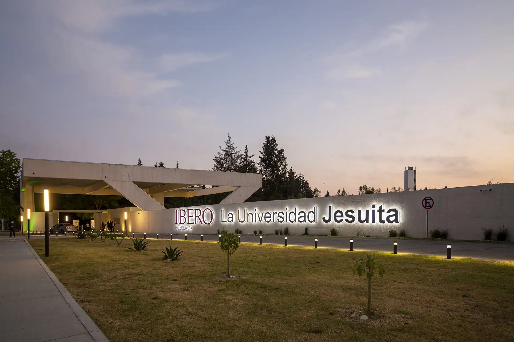
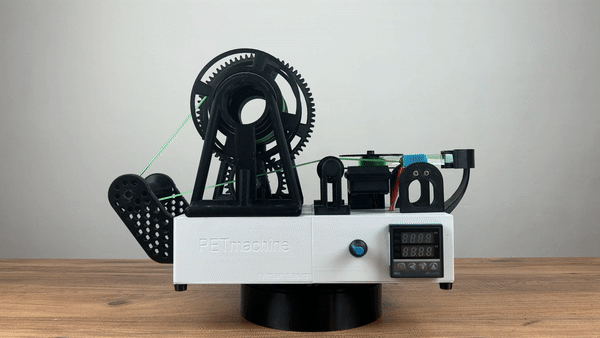
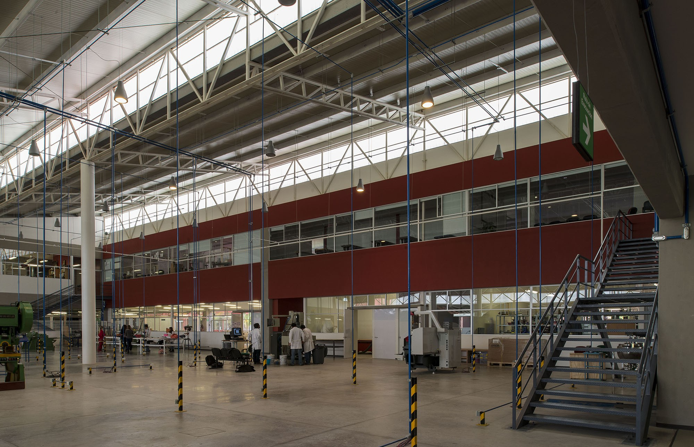

---
hide:
  - navigation
  - toc
---

## 📄 **Explora la documentación**

# ♻️ Proyecto Recicladora de Plástico PLA

  

## 🚀 Introducción

<b>Objetivo:</b> 
Crear una solución tecnológica <b>sostenible</b> para el <b>reciclaje de PLA</b> (ácido poliláctico), plástico biodegradable derivado de fuentes naturales, mediante procesos mecánicos y químicos que permitan su reutilización eficiente.

  

---

## 🌱 ¿Por qué reciclar PLA?

<ul style="font-size:1.1em; color:#006400;">
<li>PLA es un plástico biodegradable ideal para reducir huella ambiental.</li>
<li>Facilita la economía circular y reduce residuos plásticos convencionales.</li>
<li>Promueve el uso responsable de recursos naturales renovables.</li>
<li>Contribuye a la lucha contra la contaminación y el cambio climático.</li>
</ul>

  

---

## 🔬 Propiedades del PLA

  

<table style="width:60%; border-collapse: collapse; font-size:1.1em;" border="1" align="center">
  <tr style="background-color:#90EE90;">
    <th style="padding:8px;">Propiedad</th>
    <th style="padding:8px;">Valor</th>
  </tr>
  <tr>
    <td style="padding:8px;">Biodegradable y compostable</td>
    <td style="padding:8px;">✔️</td>
  </tr>
  <tr>
    <td style="padding:8px;">Temperatura de fusión</td>
    <td style="padding:8px;">150-160 °C</td>
  </tr>
  <tr>
    <td style="padding:8px;">Rango de procesamiento</td>
    <td style="padding:8px;">160-190 °C (inyección)</td>
  </tr>
  <tr>
    <td style="padding:8px;">Resistencia térmica</td>
    <td style="padding:8px;">Baja (>55 °C sensible a deformaciones)</td>
  </tr>
  <tr>
    <td style="padding:8px;">Origen</td>
    <td style="padding:8px;">Almidón de maíz, caña de azúcar, yuca</td>
  </tr>
</table>

---

## 🛠️ Metodología de Reciclaje

### ♻️ Reciclaje Mecánico  
<ul>
<li>Trituración y lavado del material</li>
<li>Secado para eliminar humedad</li>
<li>Reextrusión en pellets o filamentos</li>
</ul>

### 🔄 Reciclaje Químico  
<ul>
<li>Despolimerización para obtener monómeros puros</li>
<li>Purificación y re-polimerización</li>
<li>Ideal para PLA contaminado o degradado</li>
</ul>

  

---

## 💻 Proyecto Tecnológico

<ul>
<li>Desarrollo de software y documentación con <b>MkDocs + Material</b></li>
<li>Control y automatización del proceso de reciclaje</li>
<li>Página web para documentación y gestión del proyecto</li>
<li>Código abierto alojado en <a href="https://github.com/Mrlogros/Recicladora-de-plastico-PLA" target="_blank" style="color:#006400; text-decoration:none;"><b>GitHub</b></a></li>
</ul>

---

## 📂 Estrategia de Trabajo

<ol>
<li>Clonar repositorio desde GitHub</li>
<li>Instalación y configuración de herramientas (Git, Python, MkDocs)</li>
<li>Documentar avances y procesos técnicos</li>
<li>Desarrollar prototipos de maquinaria y software de control</li>
<li>Validar resultados y mejorar procesos</li>
</ol>

---

